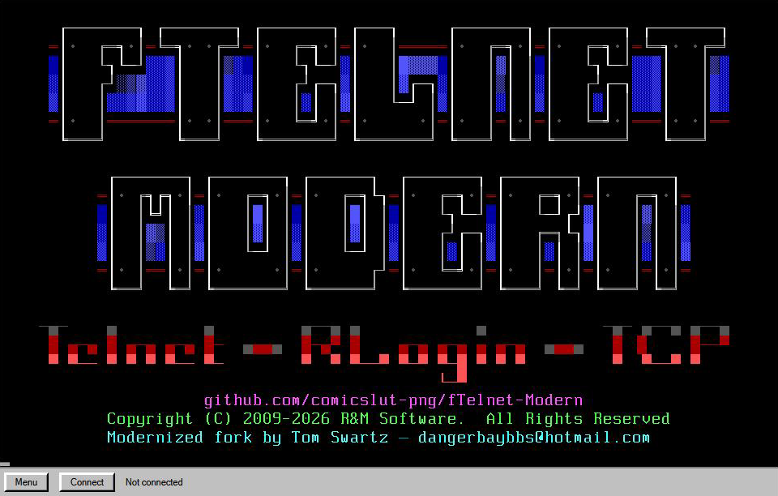
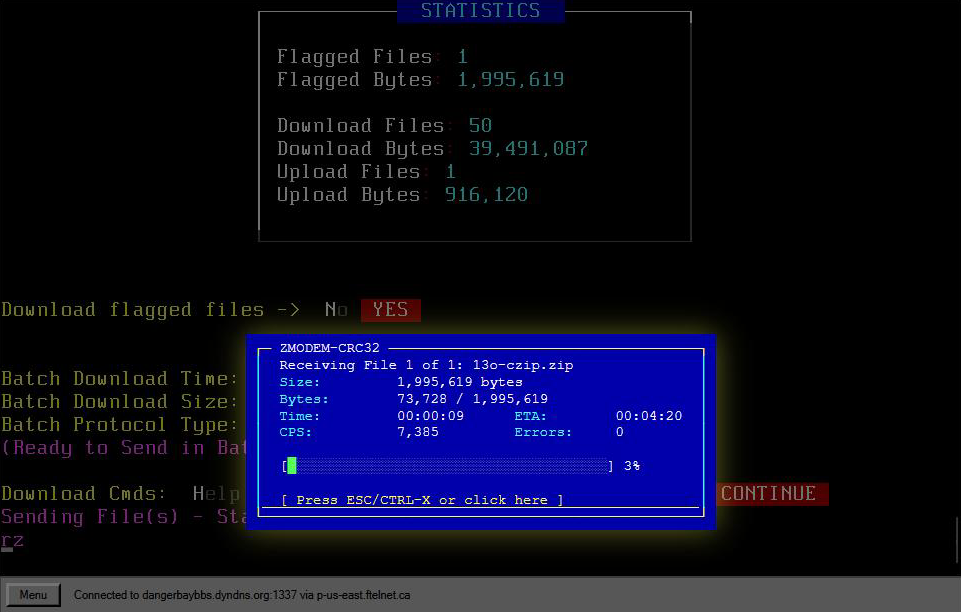

# fTelnet-Modern

An HTML5 WebSocket client for connecting to BBSes and other text-mode
hosts. This repository is a modernization fork of the original fTelnet
by Rick Parrish (R&M Software), bringing the 2017-era TypeScript
codebase up to a current toolchain while preserving every feature and
the BBS-era aesthetic.





> **fTelnet-Modern** — Copyright © 2026 Tom Swartz
> &lt;dangerbaybbs@hotmail.com&gt;
> Based on **fTelnet** — Copyright © 2009-2026 R&M Software (Rick Parrish)
> Licensed under [AGPL-3.0-or-later](https://www.gnu.org/licenses/agpl-3.0.html)
> · See [`NOTICE`](./NOTICE) and [`LICENSE`](./LICENSE) for details.

## Status

This is a multi-phase modernization shipped in small reviewable
deltas. Each phase has multiple stages; each stage is independently
applicable.

| Phase                                                                  | Status                        |
| ---------------------------------------------------------------------- | ----------------------------- |
| 1. Modernize foundation (TS 5, Vite, ESM, strict, Vitest)              | ✅ Complete                   |
| 2. Refactor UI layer into Lit Web Components                           | ✅ Complete (6 stages)        |
| 3. Neo-retro chrome facelift (theming system, settings panel, 6 themes) | ✅ Complete (3 main + deltas) |
| 4. ZMODEM file transfer + transfer progress panel                      | ✅ Complete (7 stages)        |
| 5. Polish (PWA, performance, upload UI, docs)                          | 🚧 In progress                |

### What works today

- **Modern build**: TypeScript 5.9 strict, Vite 5, ESM, Vitest 2 — full
  dev-server with hot reload.
- **Lit component architecture**: every UI element (focus warning,
  scrollback bar, status bar, menu popup, virtual keyboard, settings
  panel, transfer progress panel) is a `<f-*>` web component using
  light DOM so existing CSS selectors keep working.
- **Theming system**: 6 built-in themes selectable at runtime:
  - **Classic** — the original fTelnet look (blue/white/green panels)
  - **DOS-Classic** — Windows 3.1 gray bevels + CGA accents
  - **CRT-Green** — phosphor-on-black with subtle text-shadow glow
  - **Cyberpunk** — magenta/cyan neon, ALL-CAPS HUD labels
  - **Gothic** — blood-red serifs on near-black
  - **Cartoon** — primary colors, thick black outlines, Comic Sans
- **Settings panel**: runtime theme switching, bell-sound mute,
  vibrate-duration slider, and an **About** section showing version,
  fork author, upstream attribution, and license info. All preferences
  persist in localStorage.
- **In-app user manual** (new in beta.3): a friendly Manual button
  on the main menu opens a floating, draggable, resizable popup
  with the complete user guide. Covers every menu button, how file
  transfers work, BBS display styles (ANSI / PETSCII / ATASCII /
  Topaz), and troubleshooting tips. Written for all experience
  levels — from users who've never seen a BBS to seasoned sysops.
- **Multilingual UI** (new in beta.6): a Language picker in
  Settings switches the client chrome between languages. Ten ship
  functional today — English, German, French, Spanish, Portuguese,
  Dutch, Italian, Russian (the first non-Latin script), Swedish, and
  Polish — with room in the picker to add more. Built on a simple
  per-language string catalog with English fallback, so any
  untranslated text stays readable and adding a language is
  catalog-only. The main menu and status bar are translated; other
  areas follow in later releases.
- **ZMODEM file transfers** (new in Phase 4): receive downloads from
  any BBS that speaks ZMODEM. Auto-detects when the BBS initiates a
  transfer; no user configuration required. Confirmed working across
  the BBS trifecta: **Synchronet**, **Mystic**, and **PCBoard**.
  Real-time SyncTERM-style progress panel shows file name, byte
  counts, transfer rate (CPS), elapsed time, ETA, and error count,
  updated at 10 Hz. Press **ESC** or **CTRL-X** during a transfer
  to abort cleanly.
- **YMODEM file transfers**: send and receive, available as a
  legacy fallback for older BBSes that don't speak ZMODEM. Switch
  to YMODEM via **Settings → Protocol → YMODEM**; the menu's
  Upload/Download buttons then act on YMODEM with the original
  in-canvas progress dialog. ZMODEM remains the default.
- **Multi-platform BBS rendering**: faithful character-set and
  palette support for vintage BBS styles, well beyond just PC
  ANSI. Switching is sysop-configured at embed time
  (`Options.Emulation = '...'`), so users connecting to these
  BBSes see them as they were designed to look:
  - **ANSI / CP437** — the default. Classic PC-style colors,
    box-drawing characters, blink attribute. What most BBSes
    use today.
  - **PETSCII** — Commodore 64 / 128 BBSes. The light-blue-on-dark
    blue palette, the blocky character set, the inverted graphics.
    `Emulation = 'C64'`.
  - **ATASCII** — Atari 8-bit BBSes. Pale-blue-on-dark-blue
    palette, the Atari character set, control codes that move
    the cursor rather than print escape sequences.
    `Emulation = 'Atari'`.
  - **Topaz / Amiga ANSI** — Amiga BBSes. The Amiga's signature
    Topaz font is bundled in several sizes (Topaz, TopazPlus,
    8x11, 8x16), along with MicroKnight, MoSoul, PotNoodle, and
    other classic Amiga fonts. Renders Amiga-style art and menus
    faithfully on a modern browser.
  - **RIPscrip** — graphical mode for BBSes that serve RIP.
    Enabled by the sysop at embed time (`Options.Emulation = 'RIP'`)
    in the `rip.*` builds. The RIPscrip 1.54 parser is preserved
    from the original fTelnet.

  Together these cover essentially every text-mode BBS style that
  ever existed. If a BBS still runs anywhere today, fTelnet-Modern
  can render it.
- **Custom splash screen**: hand-crafted fTelnet-Modern ANSI block-art
  greets users on connect, displayed above R&M Software's preserved
  copyright line and the fork-credit line.
- **All original features intact**: telnet negotiation, virtual
  keyboard, copy/paste, scrollback, focus warning, screen-size
  selector, modern/classic scrollback modes, and the full font
  collection. The ANSI/CTERM parser, RIPscrip interpreter, and
  multi-platform rendering listed above are inherited from
  upstream and remain working — fTelnet-Modern preserves them
  while building new conveniences around them.

### What's coming in Phase 5

Polish work and remaining UX gaps:

  - **Upload UI** ✅ — multi-file drag-and-drop send with a
    drag-anywhere drop overlay, theme-aware upload confirmation
    panel, and the SyncTERM-style progress panel updating
    per-file. Use the BBS's batch upload area for multi-file
    sends; the single-file upload command processes one file per
    ZMODEM session by design.
  - **ZMODEM sender hardening** ✅ — added during Phase 5 after
    real-world testing surfaced a missing XON byte after ZCRCW
    subpackets (per Forsberg's reference). Plus resync retry
    timer, stale-ZRPOS dedup, and ZNULLS-before-resync as
    defensive scaffolding. See `docs/phase5-zmodem-saga.md` for
    the full diagnostic arc.
  - **Default Transfer Protocol setting** ✅ — Settings panel now
    has a Protocol picker (ZMODEM / YMODEM). The menu's Upload and
    Download button labels reflect the active protocol
    ("Upload (ZMODEM)" etc.), and clicking them routes to the
    matching state machine. With ZMODEM selected, the Download
    button shows a hint dialog explaining that ZMODEM downloads
    auto-detect on receipt of the BBS's ZRQINIT trigger. YMODEM
    upload was previously unreachable from the UI — now wired
    through the same drag-drop confirm flow.
  - **Large-file save performance** — current per-byte accumulator
    pattern causes a multi-second freeze when ZMODEM finishes a
    multi-MB file. Fix queued for early in Phase 5.
  - **In-canvas progress panel** — the current panel is a DOM overlay
    on top of the canvas. Phase 5 adds an opt-in mode that renders
    the progress inside the canvas itself (useful for fullscreen
    embed modes).
  - **YMODEM auto-detect** — deferred. ZMODEM has a distinctive
    six-byte trigger sequence (`** <ZDLE> B 0 0`) that's
    essentially impossible to occur in normal text; YMODEM's start
    pattern (SOH + block 0 + block-number bytes) collides with
    common ANSI bytes and would risk false positives that hijack
    the terminal display. YMODEM stays user-initiated via the
    Download button (with YMODEM picked as the default protocol).
  - **Splash screen rotation** — when additional ANSI splashes are
    designed, the existing single-splash constant becomes an array
    with a random-pick on connect.
  - **PWA support, embed wizard refresh, ad-hoc polish.**

See `docs/` for stage-by-stage planning notes:
  - `phase4-references.md` — ZMODEM implementations we consulted informally
  - `phase4-ui-decision.md` — transfer-progress panel design doc
  - `phase5-zmodem-saga.md` — the multi-delta ZMODEM diagnostic arc
  - `future-protocols.md` — possible additional protocols (HSLink, etc.)

### Test coverage

1212 unit tests across 55 files, run on every commit. Phase boundaries:

  - End of Phase 1: 559 tests
  - End of Phase 2: 691 tests
  - End of Phase 3: 722 tests
  - End of Phase 4: 980 tests
  - Phase 5 (in progress): 1212 tests

## Testing against a real BBS

Once a build is loaded in the browser, you can connect to any live
BBS to exercise the full ANSI + ZMODEM stack.

**Recommended test BBSes:**

  - **Diamond Mine Online** (`sbbs.dmine.net:24`) — long-running
    Synchronet BBS in Fredericksburg, VA, in operation since 1993.
    Large shareware file collection (programs, games, utilities,
    MIDI music) so it's a good ZMODEM target. Sysop maintains the
    *Telnet BBS Guide* and *BBS Corner* sites. Backup hostname
    `dmine.ddns.net:24` if primary is unreachable.

  - **8-Bit Boyz** (`bbs.8bitboyz.com:6502`) — Mystic BBS. Smaller
    file area, good for verifying Mystic/SEXYZ compatibility.

  - **Danger Bay** (`dangerbaybbs.dyndns.org:1337`) 
    The Official BBS Door Games & Apps Museum
    — A PCBoard BBS run by the maintainer of this fork.
    Active community with over 1900 door games and a large 
    file library.

  - **bbs.ftelnet.ca:23** — the upstream fTelnet demo server (Rick
    Parrish, R&M Software). Smaller, primarily a connectivity demo;
    useful for testing the connection flow but limited downloadable
    files.

For ZMODEM smoke-testing, the simplest path is to edit `src/main.ts`
(the dev-server entry point) to point at one of the above via Rick
Parrish's public WebSocket proxy:

```typescript
Options.Hostname = 'sbbs.dmine.net';
Options.Port = 24;
Options.ProxyHostname = 'p-us-east.ftelnet.ca';
Options.ProxyPort = 80;
Options.ProxyPortSecure = 443;
```

Save the file, then run `npm run dev` and open the page in your
browser. The proxy bridges WebSocket → raw telnet for any
`Hostname:Port` you specify, so you don't need the destination BBS
to run their own WebSocket bridge.

Once connected, log in, navigate to a file area (typically `F` from
the main menu), pick a file, and choose ZMODEM as the protocol. The
auto-detector fires when the BBS starts the transfer; the
SyncTERM-style progress panel appears, ticks in real time, and the
browser save dialog opens when the transfer completes. Press ESC or
CTRL-X mid-transfer to abort.

To exercise the upload path, navigate to the upload area and
drag-and-drop one or more files into the browser window. The drop
overlay appears, then the upload confirmation panel, then the
progress panel during the transfer. **For multi-file uploads, use
the BBS's batch upload area if available.** Most BBSes offer two
upload modes: a single-file upload command (which processes the
file immediately on receipt and ends the ZMODEM session) and a
batch upload area (which keeps the ZMODEM session alive across
multiple files, then runs PFED / integrity testing on all files
together). Drag-and-dropping multiple files in the single-file area
will succeed for the first file then be aborted by the BBS shell
when it starts processing — that's the BBS doing the right thing
for that command, not a bug in the client.

## Quick start

```bash
npm install              # install dependencies
npm run dev              # start Vite dev server with hot reload (port 5173)
npm test                 # run the full Vitest suite (1212 tests)
npm run typecheck        # tsc --noEmit
npm run build:all        # produce all four bundle flavors
```

Output bundles land in `dist/`:

- `ftelnet.norip.noxfer.js` — ANSI/BBS only, smallest bundle
- `ftelnet.norip.xfer.js` — adds YMODEM + ZMODEM file transfer
- `ftelnet.rip.noxfer.js` — adds RIPscrip graphics emulation
- `ftelnet.rip.xfer.js` — everything (~691 KB / ~150 KB gzipped)

Each comes with a source map and a minified `.min.js` variant.

## Embedding

The public API matches the original fTelnet exactly. Existing sysop
integrations continue to work unchanged.

```html
<div id="fTelnetContainer"></div>
<script src="ftelnet.norip.xfer.min.js" id="fTelnetScript"></script>
<script>
  const options = new fTelnetOptions();
  options.Hostname = 'your-bbs.example.com';
  options.Port = 23;

  // Pick the visual theme for the chrome:
  options.Theme = 'dos-classic';        // or any of the 6 themes

  // Runtime defaults the user can override:
  options.MuteSounds = false;
  options.VirtualKeyboardVibrateDuration = 25;  // ms

  const client = new fTelnetClient('fTelnetContainer', options);
</script>
```

Users can change theme / mute / vibrate at runtime via the **Menu →
Settings...** popup. Their choices override the embed defaults and
persist in localStorage. The Settings panel also includes an **About**
section showing version, fork author, upstream attribution, and
license info.

## Architecture notes

Brief orientation for contributors:

- **`src/common/`** — protocol-independent foundations: `ByteArray`
  (binary buffer with read/write cursor), `CRC` (CRC-16 and CRC-32),
  `StringUtils`, `KeyboardKeys`, telnet codes.
- **`src/connections/`** — WebSocket connection wrappers
  (TelnetConnection for raw telnet, RLoginConnection for rlogin, raw
  TCP via WebSocketConnection).
- **`src/crt/`** — the BBS canvas itself: text rendering, font loading,
  ANSI/CTERM parser, scrollback buffer, Atari/C64/PETSCII modes,
  RIPscrip integration.
- **`src/components/`** — Lit `<f-*>` web components for all UI chrome
  including `<f-transfer-progress>` (the ZMODEM progress panel).
- **`src/filetransfer/`** — ZMODEM (receive + send + auto-detector) and
  YMODEM. `TransferStats` engine powers the live progress numbers.
- **`src/ftelnetclient/`** — `fTelnetClient` and `fTelnetOptions`, the
  facade the embedded `<script>` integration sees.
- **`public/ftelnet.css`** — design tokens + theme blocks + component
  styles. Themes are CSS-only: ~30 lines of `[data-theme='...']`
  variable definitions per theme.
- **`assets/`** — source-of-truth artwork (e.g. `SPLASH1.ANS`) kept in
  the repo alongside its base64-encoded form in the source code.

Path aliases (configured in `tsconfig.json` and `vite.config.ts`):
`@common`, `@components`, `@connections`, `@crt`, `@crtcontrols`,
`@filetransfer`, `@graph`, `@ftelnetclient`.

## License

GNU Affero General Public License v3, matching upstream fTelnet.
See [`LICENSE`](./LICENSE) for the full license text and the
[`NOTICE`](./NOTICE) file for attribution details.

## Acknowledgements

Original fTelnet © Rick Parrish, R&M Software. The hard work — the
ANSI/CTERM parser, RIPscrip interpreter, telnet negotiation, font
collection, and architectural design — is his. This fork is
maintenance and modernization on top of that foundation.

Phase 4 ZMODEM implementation is cleanroom TypeScript informed by:
  - **FGasper's zmodem.js** (Apache-2.0) — the de facto JS reference
  - **zxdong262's zmodem2-js** (MIT) — TypeScript port of the Rust
    zmodem2 crate
  - **lrzsz** by Uwe Ohse (public domain) — the wire-format reference
    every BBS server uses

We consult these implementations when the spec is ambiguous; we do
not copy code from them. See `docs/phase4-references.md`.

Special thanks to the sysops of **Diamond Mine Online** (Synchronet),
**8-Bit Boyz** (Mystic), and the **PCBoard** community for providing
the live test BBSes that made the Phase 4 trifecta verification
possible.
